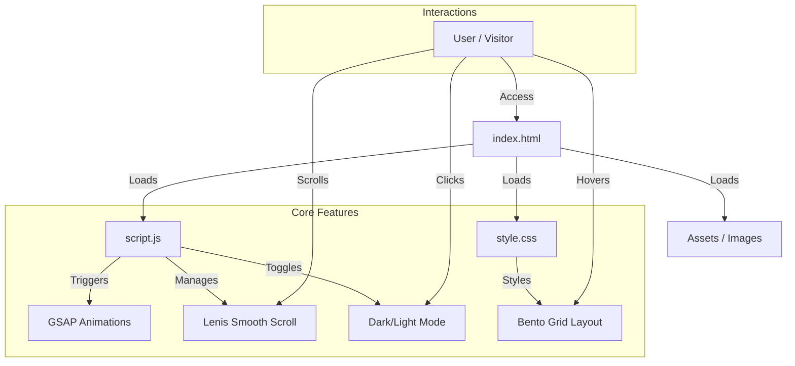
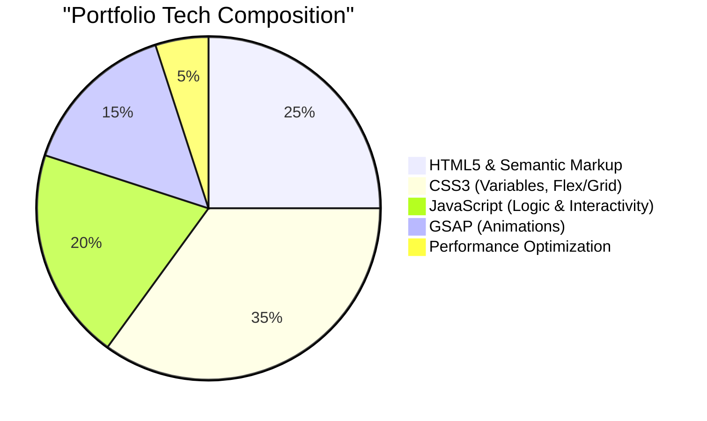

# Safaa Faraji | Software Engineer Student Portfolio

 

A high-performance, aesthetically pleasing portfolio website designed to showcase software engineering projects and skills. Built with a "Mobile-First" approach, it features clean design, smooth animations, and a professional dark mode.

🔗 **Live Demo:** [https://safaafaraji.github.io/](https://safaafaraji.github.io/)

---

## 📊 Architecture & Flow

This diagram illustrates the structure of the application and how different components interact.



## 📈 Tech Stack Analysis

A visual breakdown of the technologies and skills highlighted in this portfolio.



## ✨ Key Features

- **🎨 Futuristic Design**: Inspired by top-tier portfolios, featuring a "Bento" grid layout and glassmorphism.
- **🌗 Dark/White Mode**: Fully integrated theme switcher with persistent storage.
- **🏎️ Smooth Scrolling**: Powered by Locomotive Scroll / Lenis for a premium feel.
- **📱 Fully Responsive**: Optimized for all devices, including a custom full-screen mobile menu.
- **⚡ Performance**: Lightweight, no heavy frameworks, just pure code quality.

## 🚀 Future Updates (Roadmap)

We are constantly improving. Here is what is coming next:

- [ ] **Backend Integration**: Add a contact form backend (Node.js/Express or EmailJS).
- [ ] **Blog Section**: A space for writing technical articles and tutorials.
- [ ] **3D Elements**: Integrate Three.js for a more immersive 3D hero experience.
- [ ] **Multi-Language Support**: Add French/English toggle.
- [ ] **Project Case Studies**: Dedicated pages for deep-diving into major projects.

## 🛠️ Installation & Modification

1. **Clone the repository**
   ```bash
   git clone https://github.com/safaafaraji/safaafaraji.github.io.git
   ```
2. **Navigate to the folder**
   ```bash
   cd safaafaraji.github.io
   ```
3. **Open `index.html`** in your browser to view locally.

## 📄 License
© 2026 Safaa Faraji. All rights reserved.
